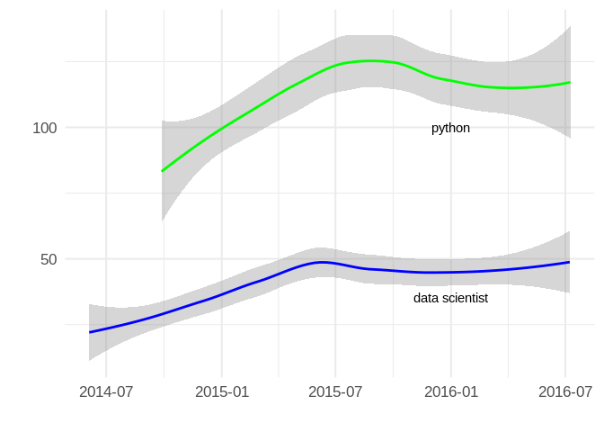

A few weeks ago, one of my fellow MIDS colleagues shared this article,
*[Tech job postings are down 40% and nobody’s talking about
it.](https://medium.com/@cameronmoll/tech-hiring-is-down-40-and-nobodys-talking-about-it-3d6f658d9faf#.tsoc36d6g)*
As a data skeptic, I wondered if it was true.

 

 

Surely, this source had insight that I didn’t and maybe it was skewed to
the job markets that company operates in, but I have really only seen
more and more growth of tech jobs here in Chicago. Albeit, that was my
feeling from receiving daily alerts to my email… which meant I was
sitting on a pile of data I could use to test that hypothesis!

Using a python CLI tool called
[Got-Your-Back](https://github.com/jay0lee/got-your-back/wiki) I was
able to download messages based on search and store them in a local
SQLite database. Keep in mind this is a pretty limited sample as I was
only signed up for “python” or “Data Scientist” job searches in the
Chicago area. Also job descriptions posted don’t always get tagged
correctly, but at least I have 2 years of data…

Turns out my data was pretty messy due to alerts not going through for
almost two months and minimal postings on the weekends. I tried
summarizing on a weekly basis in order to smooth out some of the noise,
but as you can see below there is still missing data and large outliers.

 

### Job Posts to Indeed.com for searches matching Data Scientist or python by Week

<!--html_preserve-->

<!--/html_preserve-->

 

**With a little help from the R language and the [ggplot2
package](http://docs.ggplot2.org/current/) we can see the trends a bit
more clearly.**

 

### Weekly Trends in Job posts Indeed.com for Data Scientist and python

    ## `geom_smooth()` using method = 'loess' and formula 'y ~ x'
    ## `geom_smooth()` using method = 'loess' and formula 'y ~ x'

Sure enough, it does look like jobs for these searchs peaked last
summer, but that said the trend is not downward. If anything, it just
looks like jobs matching *Data Scientist* or *python* have stabilized.

I’m really curious to see what this data shows a few months from now. In
the meantime, I’ve started collect job alerts for other data science
related searchs and different sources as well. I’ll try to update and
repost later this year.
